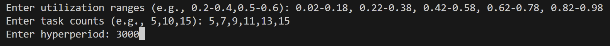

# MULTI-RATE ATTACK AWARE RANDOMIZED SCHEDULING (MAARS)
This codebase is designed to generate multi-rate schedules from task sets produced by the RandfixedSum Algorithm. The generated schedules are then analyzed to calculate two key performance metrics:
1. Inferability Ratio: This metric quantifies the inferability of the generated schedules.
2. Average Attack Probability: This metric computes the average probability of an attack within the generated schedules.

# Requirements

- Python version 3.11

### Required Packages

- `numpy`
- `matplotlib`
- `pandas`
# Usage

```bash
# Clone the repository
git clone https://github.com/yourusername/your-repo-name.git
```
The paths in the code are set for running in windows environment. For using in linux replace them with appropriate path

#### Step 1: Task Set generation
To generate synthetic task-sets execute the python script located in the main/generate_task_set directory. Run the following command: 
```bash
# Execute the Script inside \main\generate_task_set
python3 task_set_generate_randfixedsum.py
```
* This prompts the user to take 3 inputs - (i) Desired utilization range, which the user can give multiple task utilization range with comma separation, e.g. {0.02-0.18, 0.22-0.38,..}, (ii) the number of tasks e.g. $5,10,15..$ (iii) Hyperperiod length e.g. $120, 1000$.Note that taking a very high number of tasks with lengthy hyperperiods will be very time-consuming. 



#### Step 2: Schedule generation

* The schedule generation process involves executing the Python script to create schedules based on the task set data. 
* These generated schedules are inside main/data/schedules/[scheduler-directory]/[scheduler-name].txt. Each schedule text file contains lists having sequences of task IDs representing corresponding task IDs. 
* the script MAARS_multitaskset.py generates schedules of all the task sets at once in the directory main/data/schedules. This process may take a few minutes. To limit the running time, the no. of schedules has been limited to 100. This can be modified as per requirement.  

```bash
# Execute the Scripts inside \main\rt_schedulers
python3 MAARS_multitaskset.py
```

#### Step-3: Collect Attack Probability Data (Produce data for Fig. 8)

* Takes the schedule file located at main/data/schedules/ as its input. The results are exported as a CSV file to the data/attack_probability directory. The script AP_parser.py should be ran with parse arguments such as : 
```bash
#To generate AP with parse arguments go to \main\attack_probability  
python3 AP_parser.py file_name --v_i victim_id --v_p victim_period --a_i attacker_id

Example: python3 AP_parser.py schedule_util_0.02-0.18_tasks_5.txt --v_i 1 --v_p 20 --a_i 4
```
* The experimental parameters such as attack-effective windows (AEW), attack and victim task IDs and sampling rate of victim task will be different for each task set. The output is a CSV file that is stored in the main/data/attack_probability with the name P_[file_name].csv. The attack probabilities are averaged and plotted in Fig.8
```bash
#To generate AP plot directly execute this inside \main\attack_probability 
python3 AP_plot.py
```

#### Inferability Ratio

* IR_parser.py should be ran with parse arguments such as :

```bash
#To generate AP with parse arguments go to \main\inferability_ratio 
python3 IR_parser.py file_name --v_i victim_id --v_p victim_period --a_i attacker_id

Example: python3 IR_parser.py schedule_util_0.02-0.18_tasks_5.txt --v_i 1 --v_p 20 --a_i 4
```
* The experimental parameters such as attack-effective windows (AEW), attack and victim task IDs and sampling rate of victim task will be different for each task set. The output is a CSV file that is stored in the main/data/inferability_ratio with the name IR_[file_name].csv

* Fig.7 experimental data plotes are given in \plotting\matlab directory.

```bash
Execute the .m files inside
>FP_rand.m 
>MAARS.m
```


# Publication

The corresponding paper has been accepted at ICCPS in CPS-IOT Week 2025.

MAARS: Multi-Rate Attack-Aware Randomized Scheduling for Securing Real-time Systems, Arkaprava Sain, Sunandan Adhikary, Ipsita Koley, Soumyajit Dey, Dept. of CSE, Indian Institute of Technology Kharagpur, India
